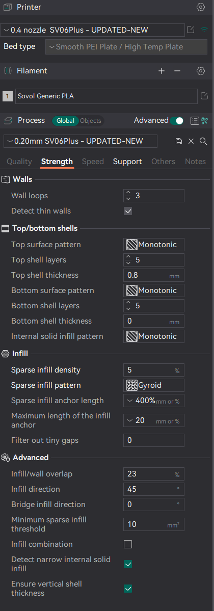
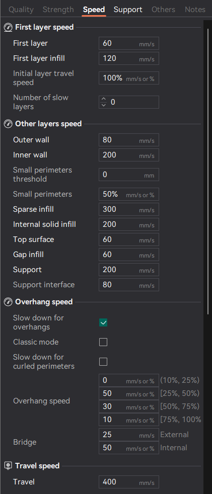
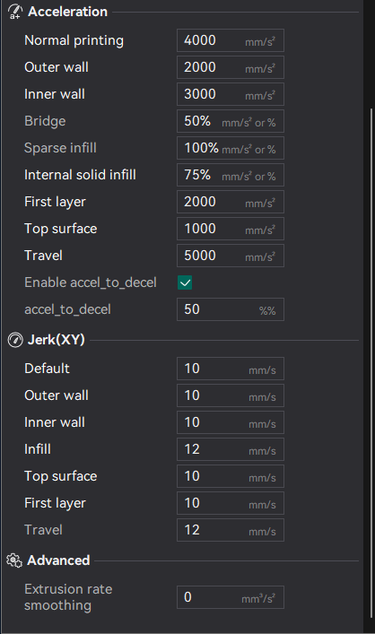

# sv06plus Orca Slicer Profile for Klipper/Mainsail

**Best Orca Slicer Configuration for Sovol SV06 Plus**

If you've landed on this page, it's likely because you've struggled to locate a reliable SOVOL SV06 profile compatible with Orca Slicer for your Klipper/Mainsail setup. If that's the case, you're in the right place – please continue reading below!

[!IMPORTANT]
**Orca Profile Settings**

> **Strength Recommendation**



> **Speed Recommendation**




> **Support Recommendation**

Regarding the Support tab, it's typically set up on a per-model basis. If you're wondering whether to add support to a particular model, it's advisable to refer to the recommendations provided by the designer of that specific model. Make adjustments according to their suggested settings.

>  **Others Recommendation**

In the "Others" section, the sole adjustment required is modifying the **Brim type**. By default, it is configured to **Auto**, but if the model possesses a substantial base, consider switching it to **No-Brim**. This prevents any potential mess around the model.

--------------- **PRINTER SETTINGS IN ORCA SLICER** ---------------

> Basic Information

On this Screen only thing you need to update is
 Printable area  click Set and set your printer size mine is 300x300 
in Advanceed 
   G-code flavor select Klipper

Then go to 
> Machine G-code Settings


> Machine start G-code

```M104 S0 ; Stops SuperSlicer from sending temp waits separately

M140 S0

print_start EXTRUDER=[first_layer_temperature] BED=[first_layer_bed_temperature]```

> Machine end G-code
```PRINT_END```


