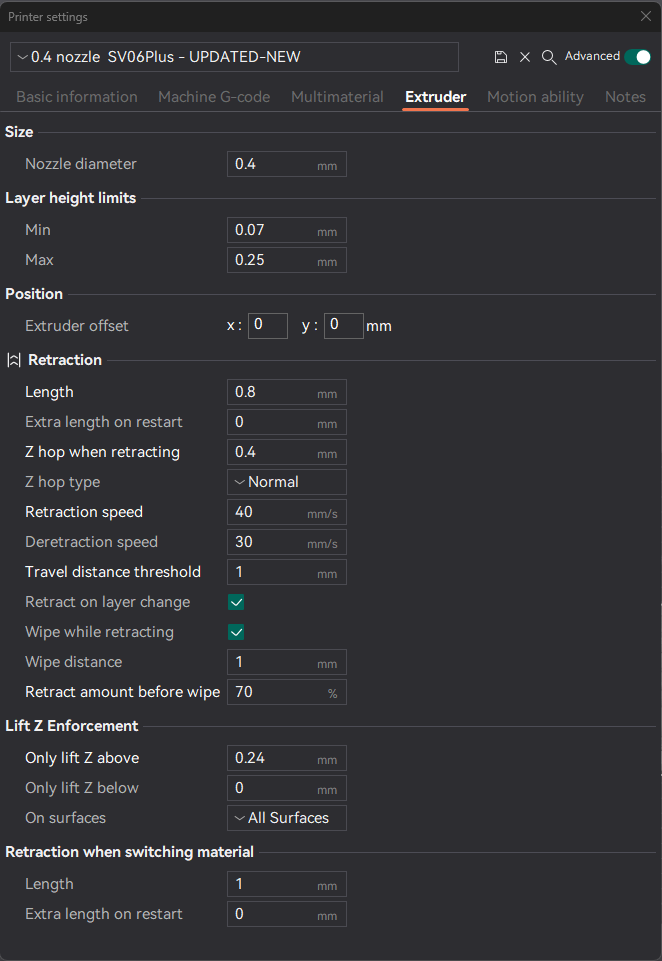
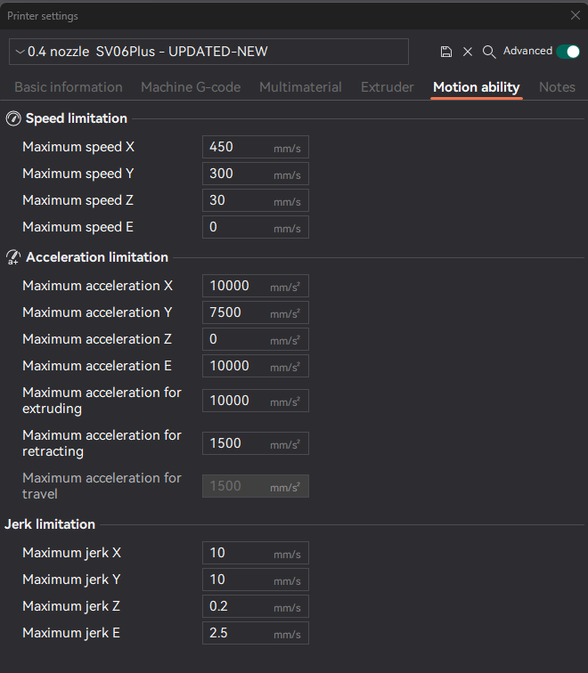

# sv06plus Orca Slicer Profile for Klipper/Mainsail

**Best Orca Slicer Configuration for Sovol SV06 Plus**

If you've landed on this page, it's likely because you've struggled to locate a reliable SOVOL SV06 profile compatible with Orca Slicer for your Klipper/Mainsail setup. If that's the case, you're in the right place – please continue reading below!

If you don't have already Orca Slicer you can download from:
https://github.com/SoftFever/OrcaSlicer/releases
Once you Install follow the steps below!

**Orca Profile Settings**

> **Strength Recommendation**


> **Speed Recommendation**


> **Support Recommendation**

Regarding the Support tab, it's typically set up on a per-model basis. If you're wondering whether to add support to a particular model, it's advisable to refer to the recommendations provided by the designer of that specific model. Make adjustments according to their suggested settings.

>  **Others Recommendation**

In the "Others" section, the sole adjustment required is modifying the **Brim type**. By default, it is configured to **Auto**, but if the model possesses a substantial base, consider switching it to **No-Brim**. This prevents any potential mess around the model.

--------------- **PRINTER SETTINGS IN ORCA SLICER** ---------------

> Basic Information

On this Screen only thing you need to update is
 Printable area  click Set and set your printer size mine is 300x300 
in Advanceed 
   G-code flavor select Klipper

> Machine G-code Settings


> Machine start G-code
```
M104 S0 ; Stops SuperSlicer from sending temp waits separately

M140 S0

print_start EXTRUDER=[first_layer_temperature] BED=[first_layer_bed_temperature]
```

> Machine end G-code

```PRINT_END```

> Extruder Settings
This Secion is Extremly Important this will save you from your nozzile hitting your model and braking and causing fail prints.


> Motion ability Settings
This Secion is Extremly Important will help you with Speed, Acceleration & Jerk limitation.



>** MAINSAIL PRINTER.CFG Settings**

in printer.cfg file I will include my current file how ever make sure you back up yours if you want to copy and use my file.

Only thing you going to need to update is the follow:
```
[printer]
kinematics: cartesian
max_velocity: 300
max_accel: 4000
max_z_velocity: 10
max_z_accel: 45
square_corner_velocity: 8
```

If you have any suggestions, please don't hesitate to reach out. Additionally, if you would like to contribute more content to this page, feel free to do so!

That is all folks
** ENOY!!! **


